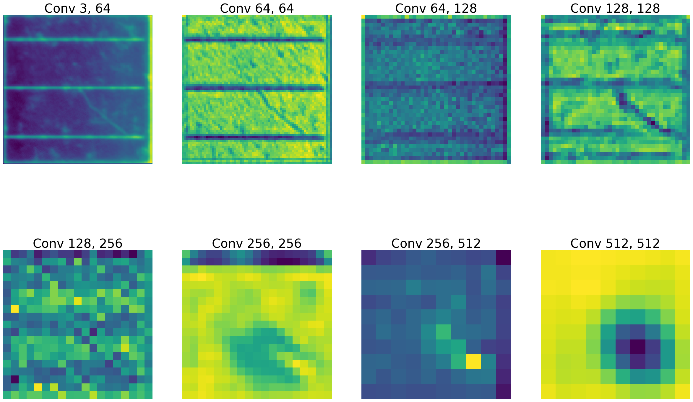

# Multi-Label Classification of Defective Solar Cells
Within this project I implemented a Residual Neural Network in PyTorch and used it for classifying defects of solar cells.
Solar cells can exhbit various types of degradation caused by inappropriate transportation, installation, or bad weather conditions such as wind or hail.
The model implemented here, focuses on the classification of two different types of defects described in more detail below. 
A ResNet-34 from PyTorch pre-trained on the ImageNet database is used for this task.

## Dataset
The training and prediction is performed on electrolumiscence images of functional and defective solar cells.
The original dataset can be found on this [github page](https://github.com/zae-bayern/elpv-dataset) but was labeled differently for the purpose of this project.

Here, the focus lies on two types of defects: 
1. **Cracks**: The size can range from very small cracks (a few pixels) to large cracks that cover the whole cell
2. **Inactive regions**: These regions are mainly caused by cracks and do not contribute to power production

Accordingly, each row in `data.csv` contains the path to an image and two numbers indicating whether the solar cell has a crack and if an inactive region exists.
The three images below show samples for each type of defect. 
A solar cell can either have a crack, an inactive region, or both with varying degrees of severity:

 &nbsp;&nbsp;  &nbsp;&nbsp; 

In total the `images/` folder contains 12,000 samples of 300x300 pixels 8-bit grayscale images. 
However, only the first 2,000 samples are unique and the rest was created through data augmentation.
Each image was flipped horizontally, vertically and rotated three times by 90 degrees, meaning 6 different variations were created for each sample.
This helps to reduce overfitting and improves classification performance.

The original 2,000 samples have the following data distribution:
- *Functional cells*: 1545
- *Cells with cracks*: 443
- *Cells with inactive regions*: 122
- *Cells with both defects*: 110

## Implementation
The code snippets below can be found in `train.py` and briefly describe the process and implementation of the model.

Initially, the dataset is split into 90% training and 10% test data. To ensure that the samples are equally distributed between both sets, a stratified split is performed:
```python
# Load the data from the csv file
df = pd.read_csv('data.csv', sep=';')

# Perform a stratified train-test-split
class_map = {(0, 0): 0, (0, 1): 1, (1, 0): 2, (1, 1): 3}
stratify_labels = [class_map[(x, y)] for x, y in df[['crack', 'inactive']].to_numpy()]
train, test = train_test_split(df, test_size=0.1, shuffle=True, random_state=2, stratify=stratify_labels)
```

For the classification the ResNet-34 of PyTorch is used which was already pre-trained on the ImageNet database. 
The original final linear layer is replaced by a linear layer with only two output neurons, since in contrast to the ImageNet dataset, we only work with two classes (Cracks and inactive regions):
```python
# Create an instance of a pretrained ResNet model
res_net = tv.models.resnet34(pretrained=True)
res_net.fc = nn.Sequential(nn.Linear(512, 2), nn.Sigmoid())
```
For experimental purposes, a custom ResNet was initially implemented in `model.py`. 
It can be modified easier, e.g. to implement [other ResNet variants](https://towardsdatascience.com/an-overview-of-resnet-and-its-variants-5281e2f56035), but has to be trained from scratch. A comparison has shown that the pre-trained variant from PyTorch performs better (i.e. has a higher f1-score), which is why it is used here.

A simple SGD with momentum is used for gradient descent:
```python
# Optimizer: SGD with Momentum
optim = t.optim.SGD(res_net.parameters(), lr=0.01, momentum=0.9, weight_decay=0.0001)
```

In addition, a learning rate decay was introduced to achieve a better convergence to the minimum and to prevent oscillation.
A higher initial learning rate also helps to accelerate the training in the beginning:
```python
# Learning rate decay
scheduler = t.optim.lr_scheduler.MultiStepLR(optim, milestones=[10, 20 , 30 , 40], gamma=0.1)
scheduler2 = t.optim.lr_scheduler.MultiStepLR(optim, milestones=[60, 80, 100, 130], gamma=0.5)
```

The Binary Cross Entropy loss is used since a solar cell can have both defects, i.e. the classes are **not** mutually exclusive:
```python
# Loss criterion for multi-label classification
loss = t.nn.BCELoss()
```

Finally, we train the model for 3 epochs:
```python
# Start training
trainer = Trainer(res_net, loss, optim, [scheduler, scheduler2], train_dl, val_dl, True)
res = trainer.fit(epochs=3)
```

### Data Augmentation
The images of the solar cells suffer from slight rotation and translation.
To make the model more robust in this regard, the following transformations are randomly applied to some samples during the training process:
- Rotation: ±3°
- Translation: ±2%
- Crop: ±2%

## Usage
The training can be started by running `train.py`. It will output the mean training loss, test loss, and f1-score for each epoch:
```shell
python ./train.py

--- Epoch 0 ---
TRAIN loss:  0.21747165854606362
VAL loss:  0.14493816259470502
F1 mean:  0.7891505377966179 

--- Epoch 1 ---
TRAIN loss:  0.14211737239388403
VAL loss:  0.11095502575491688
F1 mean:  0.862432372341214 

--- Epoch 2 ---
TRAIN loss:  0.12423488219441087
VAL loss:  0.10103361068220693
F1 mean:  0.8888840598606342
```

A snapshot of the model including its weights will be saved in `checkpoints/` after each epoch, labeled with the respective number.

The script `export_onnx.py` can be used to create a portable `.onnx` file from these snapshots and will be saved in the `onnx/` folder.
```shell
# Creating .onnx file for the model after epoch 3
python export_onnx.py 3
```

The script `visualize_activations.py` can be used to visualize the feature maps after each convolution layer. It will be placed in the `plots/` folder.
```shell
# Visualizing the feature maps for model after epoch 3
python visualize_activations.py 3
```


