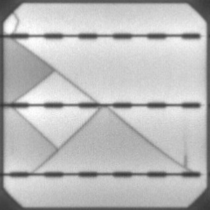
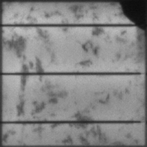
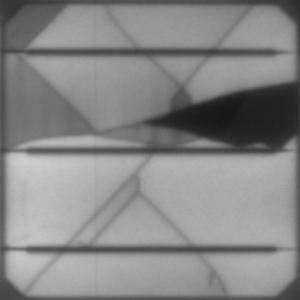

# Multi-Label Classification of Defective Solar Cells
Within this project I implemented a Residual Neural Network in PyTorch and using it for classifying defects of solar cells.
Solar cells can exhbit various types of degradation caused by inappropriate transportation, installation, or bad weather conditions such as wind, snow, or hail.
The model implemented here, focuses on two different types of defects described in more detail below. 
A ResNet-34 pretrained on the ImageNet database was used for this multi-label classification task.

## Dataset
The training and prediction is performed on electrolumiscence images of functional and defective solar cells.
The original dataset can be found on this [github page](https://github.com/zae-bayern/elpv-dataset) but was labeled differently for the purpose of this project.

Here, the focus lies on two types of defects: 
1. **Cracks**: The size can range from very small cracks (a few pixels) to large cracks that cover the whole cell
2. **Inactive Regions**: These regions are mainly caused by cracks and do not contribute to power production

Accordingly, each row in `data.csv` contains the path to an image and two numbers indicating whether the solar cell has a crack and if an inactive region exists.
The three images below show samples for each type of defect. 
A solar cell can either have a crack, an inactive region, or both with varying degrees of severity:

 &nbsp;&nbsp;  &nbsp;&nbsp; 

In total the `images/` folder contains 12,000 samples of 300x300 pixels 8-bit grayscale images. 
However, only the first 2,000 samples are unique and the rest was created through data augmentation.
Each image was flipped horizontally and vertically and rotated three times by 90 degrees, meaning 6 different variations were created for each sample.

## Model

## Usage

- Custom ResNet module from scratch
- pretrained
- visualize_activations.py